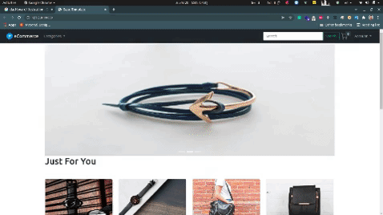

# Ecommerce Project using Django

## Features
    - SSL Commarze (All Mejore Transaction Supperted in Bangladesh)
    - Stripe (Secure Cradit card payment methode)
    - AJAX (For Realtime Product add in cart) 
    - Bootstrap 5
    - Seals analetics, etc

## Command for initiate project
```
python manage.py makemigrations
python manage.py migrate
python manage.py runserver
python manage.py migrate --run-syncdb

```
# Project Preview gif
